# Product Requirements Document — Fire TV Together

> An AI-personalized, privacy-aware Fire TV discovery and social viewing experience that helps people decide what to watch and enjoy it together across OTT services.

| Document | Value |
|---|---|
| Product | Fire TV Together — Enhanced Fire TV Experience |
| Team | OG Strikes Back, IIT Ropar |
| Stage | Hackathon prototype → integrated production-style MVP |
| Document status | Target product specification and implementation source of truth |
| Version | 2.0 |
| Last updated | 16 July 2026 |
| Related documents | [`AUDIT.md`](./AUDIT.md) · [`EXECUTION_PLAN.md`](./EXECUTION_PLAN.md) |

---

## 1. Executive summary

Fire TV Together turns the existing Amazon HackOn Season 5 prototype into one coherent product built around three connected jobs:

1. **Understand the viewing moment** using time, behavior, optional mood signals, and watch history.
2. **Find content across OTT catalogs** with explainable personal and group recommendations.
3. **Make viewing social** through live rooms with presence, chat, reactions, polls, shared queues, and server-enforced roles.

The repository already contains a polished React interface, a 45-title cross-platform catalog, multi-modal recommendation algorithms, mood and behavior experiments, and a file-based room simulator. The target MVP connects those assets through a FastAPI backend, persistent storage, typed HTTP APIs, and WebSockets while retaining an offline, zero-paid-service demo path.

This PRD deliberately separates **what exists today**, **what the MVP must deliver**, and **what requires future platform or OTT partnerships**. In particular, the MVP synchronizes room state and content selection; it does not bypass DRM, rebroadcast licensed video, or promise frame-accurate control of third-party OTT players.

### Product at a glance

| Dimension | MVP definition |
|---|---|
| Primary value | Faster, more relevant content decisions for individuals and groups |
| Primary users | Individual viewer, room host, room participant, guest viewer |
| Catalog | Existing 45 seeded titles across Netflix, Prime Video, Hotstar, and Aha |
| Personalization | Time + behavior + history + optional voice/facial/manual mood signals |
| Social | Real-time room presence, chat, reactions, queue, polls, and permissions |
| Default operation | Fully local/offline after dependency installation; no paid APIs |
| Target deployment | React/Vite frontend + FastAPI service + SQLite locally/Postgres in hosted environments |

---

## 2. Context and opportunity

### 2.1 User problem

TV discovery is fragmented across apps, recommendations rarely account for the viewer's current context, and choosing for a group creates decision fatigue. Social viewing adds another layer of friction: people coordinate in a separate chat, disagree on what to watch, and lack a shared queue or lightweight consensus mechanism.

### 2.2 Existing product assets

| Asset | Current strength | Current limitation |
|---|---|---|
| React Fire TV UI | Polished design with 17 logical screens and reusable components | All data and interactions are local; no loading/error states |
| Catalog | 45 titles, 15 curated rows, 12 genres, 4 OTT platforms | Seed data only; availability is not live provider data |
| Personal recommendation prototype | 4×6 multi-modal matrix, history decay, adaptive weights | Standalone NumPy simulations with synthetic inputs |
| Group recommendation prototype | 6×6 emotion/modality aggregation and consensus ranking | Standalone simulation; agreement metrics need production correction |
| Context analyzers | Time blocks, behavior clustering, emoji mapping, facial and voice experiments | Duplicated modules; optional dependencies; no common service contract |
| Room simulator | Admin/co-admin/member roles, queues, polls, toggles, and moderation actions | File-based CLI state with no locking or browser connectivity |
| Watch-party UI | Chat, queue, reactions, participant display, webcam controls | Single-browser state; password is collected but ignored |

### 2.3 Core opportunity

The opportunity is not to invent a new demo. It is to connect the strongest existing artifacts into a credible vertical slice where a viewer can arrive as a guest, receive an explainable recommendation, create or join a room, reach a group decision, and see every room interaction update live in another browser.

---

## 3. Product vision and principles

### 3.1 Vision

**Fire TV should feel aware of the moment and shared by default: one place to discover the right content, understand why it fits, and enjoy the decision with others.**

### 3.2 Product principles

- **Useful before invasive:** time, explicit choices, and behavior can personalize without a camera or microphone.
- **Consent is a feature:** facial and voice signals are optional, session-scoped, and clearly explained.
- **Explain the recommendation:** every ranked result states the signals that influenced it.
- **Group fairness over loudest-member wins:** group ranking balances median preference, mean preference, agreement, and suitability.
- **Server-authoritative realtime:** roles and shared room state are enforced on the backend, not trusted to a browser.
- **Demo resilience:** the catalog remains usable when the backend or optional AI provider is unavailable.
- **Build from existing proof:** preserve the UI and algorithm provenance while eliminating duplication in production code.

---

## 4. Goals, non-goals, and success definition

### 4.1 Goals

| ID | Goal | Evidence of success |
|---|---|---|
| G1 | Deliver one connected end-to-end product | Guest → recommendation → room → live interaction works without manual data edits |
| G2 | Make personal recommendations contextual and explainable | Ranked results include score, contributing signals, and fallback provenance |
| G3 | Make group decisions fast and equitable | Group list includes consensus, agreement, and selectability calculated per member |
| G4 | Make watch parties genuinely multi-client | Two browser sessions see presence, chat, reactions, queue, poll, and role updates live |
| G5 | Preserve a zero-cost demo path | Default setup requires no paid key and runs with local providers |
| G6 | Create a maintainable foundation | Typed contracts, deterministic engines, tests, environment config, and one-command local startup |

### 4.2 Non-goals for the MVP

- Hosting, proxying, or rebroadcasting licensed video.
- Bypassing OTT authentication, subscriptions, geographic restrictions, or DRM.
- Frame-accurate playback synchronization across third-party players without supported partner APIs.
- Live ingestion of the complete catalogs of Netflix, Prime Video, Hotstar, or Aha.
- Purchasing or managing real OTT subscriptions; the current subscriptions screen remains demonstrative.
- Training new facial, voice, or language models.
- Production-scale multi-region deployment, recommendation model training infrastructure, or a Neo4j graph.
- Replacing the native Fire TV operating system; the MVP is a web-based product demonstration.

### 4.3 MVP success gate

The MVP is successful only when all of the following pass:

1. A fresh clone starts through documented commands in under 10 minutes on a supported machine.
2. Guest access works without credentials; registered access persists lists, history, and preferences.
3. Home recommendations are served by the API and identify the time, behavior, history, and available mood signals used.
4. Missing camera, microphone, model, or backend access produces a clear fallback instead of a broken journey.
5. Two browser tabs in one room exchange presence, chat, reactions, queue changes, polls, and admin changes in real time.
6. Password-protected rooms reject an invalid password and never expose the password or its hash.
7. Recommendation math, authorization, and room lifecycle tests pass; frontend type-check and production build pass.
8. No paid service or third-party secret is required for the default demo.

---

## 5. Users and jobs to be done

| Persona | Primary need | Key journey | Permission level |
|---|---|---|---|
| Individual viewer | Find something relevant without opening several apps | Enter → set/skip mood → browse recommendations → save or play/deep-link | Own profile and lists |
| Room host | Bring people together and resolve what to watch | Create room → invite → review group picks → manage queue/poll → moderate | Admin |
| Room participant | Join quickly and influence the group choice | Join by code → contribute signals → vote/chat/react → follow queue | Member; may become co-admin |
| Guest viewer | Try the experience with no signup friction | Continue as guest → receive session recommendations → join/create demo room | Session-scoped access |
| Co-admin | Help manage an active room | Moderate chat/queue/polls within granted permissions | Elevated room access |

### Accessibility and remote-first interaction

The product must remain operable by keyboard and Fire TV-style directional navigation. Core actions require visible focus states, readable contrast, semantic labels, and no dependence on hover. Camera and microphone controls must always have text or accessible labels and must never auto-enable without an explicit consent step in the target MVP.

---

## 6. Scope and release boundaries

### 6.1 Prioritization

| Capability | MVP — Must | Next — Should | Later — Could |
|---|:---:|:---:|:---:|
| Seeded catalog, search, filters, detail, platform attribution | ✓ |  |  |
| Guest and registered sessions | ✓ |  |  |
| Personal recommendations: time, behavior, history, explicit/heuristic mood | ✓ |  |  |
| Recommendation explanation and fallback provenance | ✓ |  |  |
| Optional ONNX facial provider with graceful fallback |  | ✓ |  |
| Optional local LLM or voice mood provider |  | ✓ |  |
| Adaptive per-user modality weights | ✓ |  |  |
| Friends, requests, suggestions, and friend movie feed | ✓ |  |  |
| Real-time room presence, chat, reactions, and synchronized queue | ✓ |  |  |
| Admin/co-admin/member permissions | ✓ |  |  |
| Group recommendations and polls | ✓ |  |  |
| Shared playlists and richer moderation controls |  | ✓ |  |
| Reconnect with event replay and Redis scale-out |  | ✓ |  |
| Live OTT catalog ingestion and availability verification |  |  | ✓ |
| Partner-supported playback synchronization |  |  | ✓ |
| VR filters and background replacement |  |  | ✓ |
| Native Fire TV packaging and Alexa device integration |  |  | ✓ |

### 6.2 Cross-OTT scope clarification

For the MVP, “cross-OTT” means unified discovery, platform attribution, shared recommendations, a synchronized selection/queue, and optional provider deep links where a valid link is available. The system does not play protected OTT streams itself. Catalog availability is seeded demo data and must be labeled accordingly until a licensed, current source is integrated.

---

## 7. End-to-end experience

### 7.1 Product journey

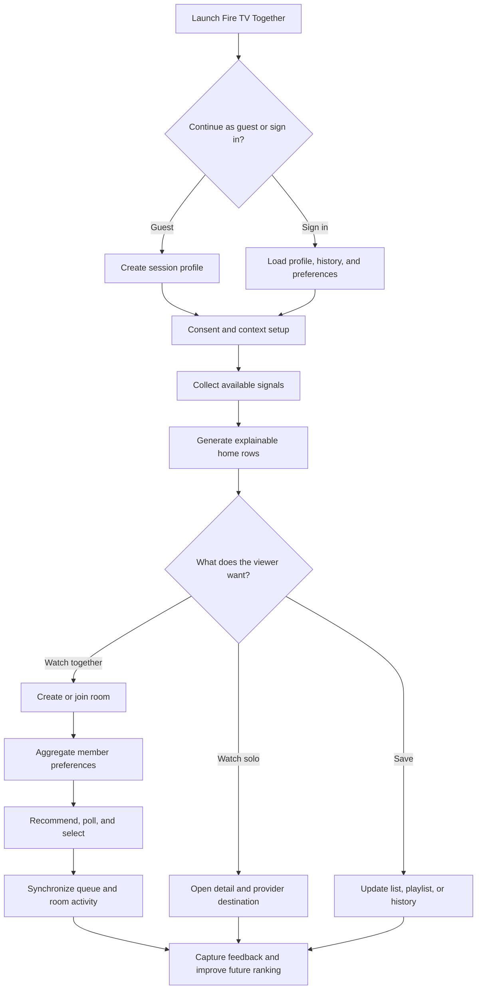

### 7.2 Information architecture

```mermaid
flowchart TB
    ROOT["Fire TV Together"]
    ROOT --> DISCOVER["Discover"]
    ROOT --> LIBRARY["Library"]
    ROOT --> SOCIAL["Social"]
    ROOT --> SERVICES["Services"]
    ROOT --> ACCOUNT["Account"]

    DISCOVER --> HOME["Home and personalized rows"]
    DISCOVER --> SEARCH["Search"]
    DISCOVER --> CATEGORIES["Categories"]
    DISCOVER --> DETAIL["Movie detail"]
    DISCOVER --> PLATFORM["Platform page"]

    LIBRARY --> LIST["My List and Watch Later"]
    LIBRARY --> PLAYLISTS["Playlists"]
    LIBRARY --> HISTORY["History"]

    SOCIAL --> FRIENDS["Friends and suggestions"]
    SOCIAL --> CREATE["Create room"]
    SOCIAL --> JOIN["Join room"]
    SOCIAL --> PARTY["Live watch party"]

    SERVICES --> APPS["Apps"]
    SERVICES --> GAMES["Games"]
    SERVICES --> SUBSCRIPTIONS["Subscriptions demo"]

    ACCOUNT --> DASHBOARD["Dashboard"]
    ACCOUNT --> SETTINGS["Settings, consent, and privacy"]
```

### 7.3 Personal discovery happy path

1. The viewer enters as a guest or authenticated user.
2. The product explains available context signals and lets the viewer enable, disable, or skip each optional source.
3. Time is derived from the device timezone; behavior comes from in-product events; history is loaded when available; mood comes from explicit text/emoji or an enabled provider.
4. The recommendation service ranks the catalog and returns explanations plus the exact signal availability used.
5. Home displays personal, time-aware, friend, trending, and recently watched rows.
6. The viewer opens a detail page, saves the title, adds it to a playlist or room queue, or follows a provider destination.
7. Completion, dismissal, save, and explicit feedback update history and adaptive weights.

### 7.4 Group viewing happy path

1. A host chooses **Create room**, sets a name, optional password, and optional starting title.
2. The server creates a short join code and makes the host the sole admin.
3. Participants join as guests or registered users; the server validates the room, password, capacity, and membership state.
4. Each participant contributes only the signals they have allowed. Missing signals are treated as unavailable, never as neutral mood.
5. The service produces group-ranked titles with agreement and selectability; the host may start a poll or choose directly.
6. Queue, presence, reactions, chat, poll state, and role changes propagate to all connected clients.
7. When the final member leaves or the host ends the room, the room closes and ephemeral events expire according to retention rules.

---

## 8. Functional requirements

Priority uses **P0** for MVP-blocking, **P1** for the first follow-up, and **P2** for future expansion.

### 8.1 Identity, sessions, and consent

| ID | Requirement | Priority | Acceptance criteria |
|---|---|:---:|---|
| FR-AUTH-01 | Continue as guest without registration | P0 | A session token is issued in one action and can call catalog, recommendation, and room APIs |
| FR-AUTH-02 | Register, sign in, refresh, sign out, and fetch current profile | P0 | Valid credentials create a session; invalid credentials return a generic error; sign-out invalidates refresh state |
| FR-AUTH-03 | Persist lists, history, friends, preferences, and adaptive weights for registered users | P0 | Data is restored after a new browser session |
| FR-AUTH-04 | Keep guest state session-scoped and merge only after explicit account creation | P0 | Guest activity is not attached to an account without confirmation |
| FR-CONSENT-01 | Present independent controls for facial, voice, behavioral, and personalization data | P0 | The viewer can skip any optional source and still receive recommendations |
| FR-CONSENT-02 | Show active signal sources and allow revocation | P0 | Revocation stops future collection and applies the configured deletion policy |

### 8.2 Catalog and discovery

| ID | Requirement | Priority | Acceptance criteria |
|---|---|:---:|---|
| FR-CAT-01 | List and paginate catalog titles | P0 | The 45 seeded titles load with stable IDs and complete display metadata |
| FR-CAT-02 | Search by title and filter by genre, platform, category, year, and rating | P0 | Combined filters are deterministic and empty results have a useful recovery state |
| FR-CAT-03 | Fetch movie detail and related titles | P0 | Unknown IDs return 404; related results never include the current title |
| FR-CAT-04 | Serve hero slides and curated home rows | P0 | Rows have stable keys, ordered titles, and no duplicate title within one row |
| FR-CAT-05 | Display provider attribution and demo-data freshness label | P0 | No title is presented as currently available based only on stale seed data |
| FR-CAT-06 | Open a provider destination only from an approved configured link | P1 | Missing links produce a clear “provider link unavailable” state |

### 8.3 Context analysis and personal recommendations

| ID | Requirement | Priority | Acceptance criteria |
|---|---|:---:|---|
| FR-CTX-01 | Resolve one of six time blocks from user timezone | P0 | Boundary tests cover 00:00, 06:00, 10:00, 14:00, 18:00, 22:00, and timezone changes |
| FR-CTX-02 | Classify in-product behavior events into six prototype clusters | P0 | The same ordered event fixture always produces the same cluster and confidence |
| FR-CTX-03 | Map the 12 supported emoji inputs to six emotions | P0 | Response returns normalized emotion vector, dominant emotion, confidence, and sample size |
| FR-CTX-04 | Analyze explicit text through the default heuristic mood provider | P0 | Empty/unsupported input returns `unknown`, not a fabricated mood |
| FR-CTX-05 | Support optional ONNX, local LLM, and voice providers behind one provider interface | P1 | Provider failure returns an unavailable status and falls back without a 5xx journey failure |
| FR-REC-01 | Rank the catalog with deterministic personal recommendation math | P0 | Fixed fixtures reproduce documented matrix output and stable ordering |
| FR-REC-02 | Blend live context with exponentially decayed history | P0 | No-history users use live context only; history weights sum to 1 |
| FR-REC-03 | Adapt per-user modality weights from explicit/implicit feedback | P0 | Updated weights stay in [0,1], sum to 1, and are persisted for registered users |
| FR-REC-04 | Renormalize around unavailable optional signals | P0 | Disabling voice or facial input does not lower scores merely because the signal is absent |
| FR-REC-05 | Explain each recommendation | P0 | Every item identifies top contributing signals, final score, and whether fallback data was used |
| FR-REC-06 | Record a recommendation impression and outcome | P0 | Request ID connects the shown list to select/save/dismiss/complete feedback |

### 8.4 Group recommendations

| ID | Requirement | Priority | Acceptance criteria |
|---|---|:---:|---|
| FR-GRP-01 | Build a member preference matrix from available time, behavior, facial, voice, emoji, and text signals | P0 | Missing modality cells are excluded and remaining weights are normalized |
| FR-GRP-02 | Aggregate members with 70% median + 30% mean | P0 | Cell-level fixtures verify the aggregation and clipping to [0,1] |
| FR-GRP-03 | Rank titles using raw match, popularity, and group suitability | P0 | Fixed group fixtures produce stable scores and ordering |
| FR-GRP-04 | Calculate agreement and selectability from per-member candidate scores | P0 | Standard deviation uses all eligible members; selectability is the percentage above the configured threshold |
| FR-GRP-05 | Protect member privacy in explanations | P0 | Explanations summarize the group and never expose another member's mood or raw signals |
| FR-GRP-06 | Recompute when membership or material preference input changes | P0 | Results include a version and never overwrite a newer room result |

### 8.5 Watch-party rooms

| ID | Requirement | Priority | Acceptance criteria |
|---|---|:---:|---|
| FR-ROOM-01 | Create a room with name, optional password, capacity, and optional initial movie | P0 | Response contains a unique short code; password is hashed and never returned |
| FR-ROOM-02 | Join by code with validated password and capacity | P0 | Invalid code/password, full room, kicked member, and closed room have distinct safe errors |
| FR-ROOM-03 | Maintain authoritative presence | P0 | Join, disconnect, reconnect, and leave update all clients without duplicate members |
| FR-ROOM-04 | Exchange chat and emoji reactions | P0 | Messages/reactions are ordered, attributed, length-limited, rate-limited, and permission-checked |
| FR-ROOM-05 | Synchronize queue add, remove, reorder, and play-next actions | P0 | All clients converge on the same queue version after concurrent changes |
| FR-ROOM-06 | Create, vote on, and end polls | P0 | One eligible member has at most one active vote per poll; closed polls reject votes |
| FR-ROOM-07 | Enforce admin, co-admin, and member permissions on the server | P0 | Crafted client events cannot bypass role checks |
| FR-ROOM-08 | Promote, demote, kick, and control room-level chat/reaction settings | P0 | Every moderation action emits an audit event and updates connected clients |
| FR-ROOM-09 | Reconnect safely | P1 | Client resumes from last acknowledged event or receives a current snapshot without duplicating actions |
| FR-ROOM-10 | End and expire rooms | P0 | Host can end the room; empty rooms expire; new joins are rejected after closure |

### 8.6 Social and library

| ID | Requirement | Priority | Acceptance criteria |
|---|---|:---:|---|
| FR-SOC-01 | List friends, requests, and suggestions | P0 | Viewer sees only relationships they are authorized to view |
| FR-SOC-02 | Accept/decline a friend request and remove a friend | P0 | Both relationship views converge transactionally |
| FR-SOC-03 | Show movie suggestions from friends | P0 | Each item identifies the suggesting friend and supports detail/save/queue actions |
| FR-LIB-01 | Manage My List and Watch Later | P0 | Add is idempotent; remove persists; duplicates are not created |
| FR-LIB-02 | Record watch progress and completion | P0 | Progress is bounded 0–100% and history ordering reflects latest activity |
| FR-LIB-03 | Create and manage personal playlists | P0 | Owner can add/remove/reorder; unauthorized users cannot mutate |
| FR-LIB-04 | Share playlists with collaborators | P1 | Owner-defined collaborator rights are enforced by the API |

### 8.7 Frontend integration and resilience

| ID | Requirement | Priority | Acceptance criteria |
|---|---|:---:|---|
| FR-FE-01 | Use one typed HTTP client and TanStack Query hooks | P0 | No screen directly constructs ad hoc network calls |
| FR-FE-02 | Provide loading, empty, offline, and retry states | P0 | Every remote-data screen has an intentional state for each condition |
| FR-FE-03 | Use a shared WebSocket client with reconnect and heartbeat | P0 | One room connection is active per browser tab and closes cleanly on leave |
| FR-FE-04 | Retain bundled-catalog static demo mode | P0 | Backend outage keeps discovery usable and clearly marks social/persistence features unavailable |
| FR-FE-05 | Preserve the existing Fire TV visual language | P0 | API wiring does not materially regress layout, navigation, or remote/keyboard focus |

---

## 9. Recommendation design

### 9.1 Personal recommendation pipeline

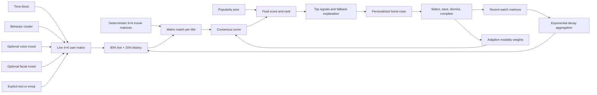

#### Canonical personal scoring

Let:

- `U_live` be the 4×6 live user matrix for time, behavior, voice, and facial modalities.
- `H` be the transposed 4×6 history matrix.
- `M_i` be title `i`'s deterministic 6×4 compatibility matrix.
- `w` be active modality weights, initially `[0.30, 0.25, 0.25, 0.20]` for time, behavior, voice, and facial.
- `p_i` be title popularity normalized to `[0,1]`.

```text
history_weight(k) = exp(-0.5 × k) / Σ exp(-0.5 × j)
U = 0.8 × U_live + 0.2 × H                     when history exists
U = U_live                                      otherwise
C_i = U × M_i                                   # 4×4
d_i = diagonal(C_i)                             # one score per modality
consensus_i = dot(d_i, normalize(active(w)))
final_i = 0.8 × consensus_i + 0.2 × p_i
```

If an optional modality is unavailable, its weight is removed and the remaining active weights are normalized. Absence is not encoded as a zero-valued emotion. Explicit text/emoji mood may populate the mood vector or act as the fallback for voice/facial context, but the API explanation must identify which source was used.

#### Adaptive weighting

```text
w_next = normalize(0.6 × w_current + 0.4 × feedback_vector)
```

Feedback may be explicit (“more like this”, rating) or derived from bounded outcomes such as selection, save, dismissal, and completion. The service must cap any single event's influence and store the reason for each update.

### 9.2 Group recommendation pipeline

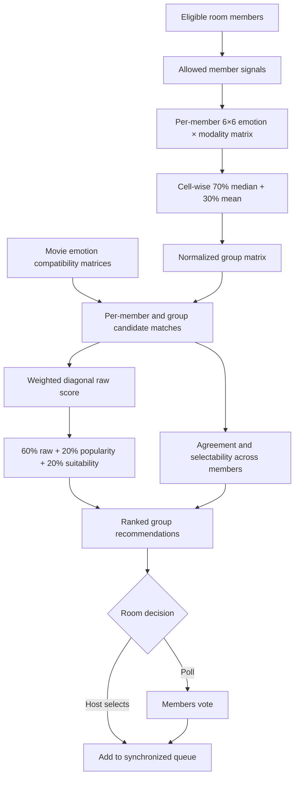

The six emotions are angry, disgust, fear, happy, neutral, and sad. The six modalities are time, behavior, facial, voice, emoji, and text. The canonical initial modality weights are `[0.15, 0.15, 0.25, 0.20, 0.15, 0.10]` in that order.

```text
G[r,c] = clip(0.7 × median(member[r,c]) + 0.3 × mean(member[r,c]), 0, 1)
raw_i = dot(diagonal(normalize(G ⊙ movie_i)), active_group_weights)
group_score_i = 0.6 × raw_i + 0.2 × popularity_i + 0.2 × suitability_i
agreement_i = standard_deviation(per_member_score_i)
selectability_i = members_with_score_above_threshold / eligible_members × 100
```

**Required correction from the prototype:** agreement and selectability must be computed from the candidate's per-member scores. The prototype passes a single aggregate score into these calculations, which always collapses the variance and cannot represent real group agreement.

### 9.3 Determinism and explanation contract

- Movie matrices are derived deterministically from stable metadata and versioned rules; request-time randomness is prohibited.
- Ties use a stable secondary sort: suitability, popularity, then movie ID.
- Every response includes `engine_version`, `request_id`, active signals, fallback status, and score components.
- Explanations use bounded templates based on score contributions; no unsupported causal claim such as “we know you feel sad.”
- Group explanations never reveal an individual's emotion, text, voice, facial result, or private history.

---

## 10. System and orchestration design

### 10.1 System context

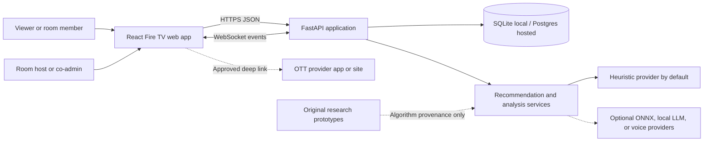

### 10.2 Target component architecture

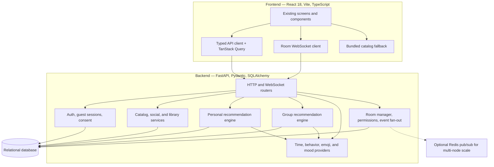

### 10.3 Personal recommendation request sequence

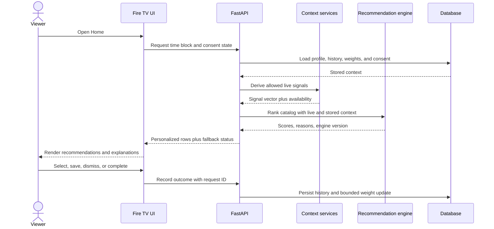

### 10.4 Watch-party realtime sequence

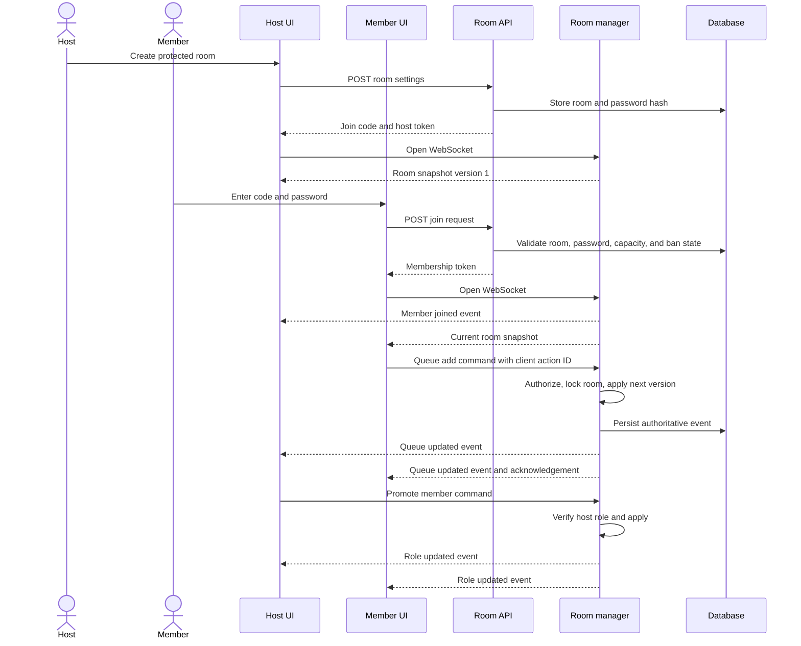

### 10.5 Room lifecycle

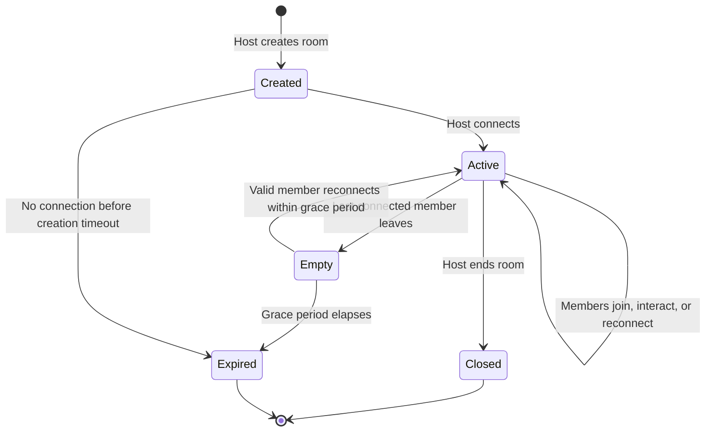

### 10.6 Server-authoritative command flow

Every room mutation follows the same contract:

1. Client sends a command with `type`, `room_id`, `client_action_id`, expected room version, and payload.
2. Server authenticates the membership token and validates schema, rate limit, role, and room state.
3. Room manager applies the command under a per-room lock and increments the room version.
4. The accepted event is persisted before or atomically with fan-out where feasible.
5. All clients receive the authoritative event; the sender also receives an acknowledgement tied to `client_action_id`.
6. Stale or duplicate commands are rejected or acknowledged idempotently without applying twice.

---

## 11. Data model

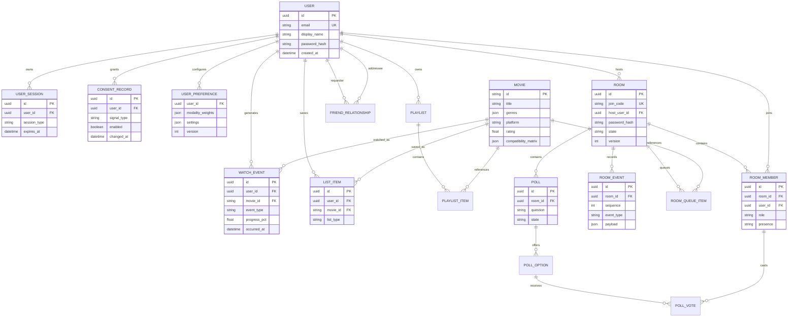

### 11.1 Data rules

- Use UUIDs internally; the short room code is a revocable lookup key, not the primary identifier.
- Email is optional for guest sessions and required only for registered accounts.
- Room membership role is one of `admin`, `co_admin`, or `member`; a room has exactly one admin.
- List items are unique on `(user_id, movie_id, list_type)`.
- Poll votes are unique on `(poll_option/poll, room_member)` according to the final schema.
- Raw camera frames and audio recordings are not part of the persistent data model.
- Recommendation requests store score components and provenance only as needed for debugging/analytics, using pseudonymous identifiers and bounded retention.

---

## 12. API and event contracts

The MVP base path is `/api`. A versioned `/api/v1` prefix should be introduced before external consumers depend on the contract.

### 12.1 HTTP endpoints

| Domain | Method and path | Purpose | Auth |
|---|---|---|---|
| Health | `GET /health` | Liveness, readiness, version, provider availability | Public |
| Auth | `POST /api/auth/guest` | Create guest session | Public |
| Auth | `POST /api/auth/register` | Create registered user | Public |
| Auth | `POST /api/auth/login` | Issue access/refresh tokens | Public |
| Auth | `POST /api/auth/refresh` | Rotate access token | Refresh token |
| Auth | `GET /api/users/me` | Fetch profile, consent, and settings | User/guest |
| Catalog | `GET /api/movies` | List/search/filter/paginate movies | User/guest |
| Catalog | `GET /api/movies/{movie_id}` | Movie detail | User/guest |
| Analysis | `GET /api/analysis/time-block` | Resolve time context | User/guest |
| Analysis | `POST /api/analysis/behavior` | Classify behavior events | User/guest + consent |
| Analysis | `POST /api/analysis/emoji` | Map emoji sequence to emotion vector | User/guest |
| Analysis | `POST /api/analysis/mood` | Run selected mood provider | User/guest + consent |
| Recommendations | `POST /api/recommendations/personal` | Rank catalog for one viewer | User/guest |
| Recommendations | `POST /api/recommendations/group` | Rank catalog for a room/group | Room member |
| Recommendations | `POST /api/recommendations/feedback` | Record outcome and update weights | User/guest |
| Rooms | `POST /api/rooms` | Create room | User/guest |
| Rooms | `POST /api/rooms/{code}/join` | Validate and join room | User/guest |
| Rooms | `GET /api/rooms/{code}` | Fetch safe room summary | Room member |
| Rooms | `POST /api/rooms/{code}/leave` | Leave room | Room member |
| Social | `GET /api/friends` | Friends, requests, suggestions | Registered user |
| Social | `POST /api/friends/requests` | Send/resolve friend request | Registered user |
| Library | `GET/POST/DELETE /api/library/items` | Manage My List and Watch Later | Registered user |
| History | `GET/POST /api/history` | Fetch or record watch activity | Registered user |
| Playlists | `GET/POST/PATCH/DELETE /api/playlists` | Manage playlists and items | Registered user |

### 12.2 WebSocket connection

`WS /ws/rooms/{code}?token=<short-lived-membership-token>`

Tokens should be passed through the platform's safest supported mechanism; avoid logging query strings. On connect, the server returns either a complete current snapshot or events after the client's last acknowledged sequence.

#### Event envelope

```json
{
  "type": "queue.item_added",
  "event_id": "uuid",
  "client_action_id": "uuid",
  "room_id": "uuid",
  "room_version": 12,
  "sequence": 84,
  "actor_member_id": "uuid",
  "occurred_at": "2026-07-16T12:00:00Z",
  "payload": {}
}
```

#### Event families

| Family | Client commands | Server events |
|---|---|---|
| Connection | `connection.resume`, `heartbeat.ping` | `room.snapshot`, `heartbeat.pong`, `error` |
| Presence | `presence.update`, `room.leave` | `member.joined`, `member.updated`, `member.left` |
| Chat | `chat.send` | `chat.message`, `chat.disabled` |
| Reactions | `reaction.send` | `reaction.created`, `reaction.disabled` |
| Queue | `queue.add`, `queue.remove`, `queue.reorder`, `queue.next` | `queue.updated` |
| Polls | `poll.create`, `poll.vote`, `poll.end` | `poll.created`, `poll.updated`, `poll.ended` |
| Moderation | `member.promote`, `member.demote`, `member.kick`, `room.setting.update` | `member.role_updated`, `member.kicked`, `room.setting_updated` |
| Room lifecycle | `room.end` | `room.ended`, `room.expired` |

### 12.3 Error contract

All HTTP and WebSocket errors use stable machine-readable codes, a safe user-facing message, a request/event correlation ID, and optional field details. Internal exception text, password state, stack traces, model paths, and another user's private information must never be returned.

---

## 13. Roles and permissions

| Action | Admin | Co-admin | Member |
|---|:---:|:---:|:---:|
| View room, presence, queue, and polls | ✓ | ✓ | ✓ |
| Chat/react when room and personal settings allow | ✓ | ✓ | ✓ |
| Vote in an open poll | ✓ | ✓ | ✓ |
| Add to queue | ✓ | ✓ | ✓ |
| Remove/reorder/advance queue | ✓ | ✓ | — |
| Create/end poll | ✓ | ✓ | — |
| Promote/demote member | ✓ | — | — |
| Kick member | ✓ | ✓* | — |
| Toggle global chat/reactions | ✓ | ✓ | — |
| End room or transfer ownership | ✓ | — | — |

`*` A co-admin cannot kick the admin or another co-admin unless the final policy explicitly grants it. The server is the sole authority for every permission decision.

---

## 14. Privacy, security, and safety

### 14.1 Privacy by design

- Camera, microphone, and behavioral personalization are opt-in and independently revocable.
- The UI explains purpose before permission and shows a persistent indicator while capture is active.
- Raw camera frames/audio are processed transiently and are never persisted by default.
- Only normalized derived signals, provider name/version, confidence, and timestamp may be stored when consent allows.
- Group computation uses derived vectors; other members never receive a participant's raw or derived private signal.
- Guest data expires automatically; registered users can clear history, derived context, and adaptive preferences.
- Analytics exclude chat text, raw media, passwords, tokens, and precise private mood labels.

### 14.2 Security requirements

- Hash passwords and room passwords with a salted, configurable password KDF; the current target is PBKDF2-HMAC-SHA256 with a documented upgrade path.
- Use short-lived JWT access tokens, rotating refresh state, and short-lived room membership tokens.
- Validate every request/event with Pydantic schemas, length limits, enum allowlists, and authorization checks.
- Apply per-IP, per-user, and per-room rate limits to auth, join attempts, chat, reactions, and room commands.
- Configure explicit CORS origins; use TLS outside localhost; never commit secrets.
- Prevent room-code enumeration with uniform errors and throttling.
- Escape user-visible text and do not render chat or titles as raw HTML.
- Record moderation and role changes in an auditable, privacy-bounded event log.
- Keep optional providers isolated behind timeouts and input-size limits; provider failure must not crash the API.

### 14.3 Consent flow

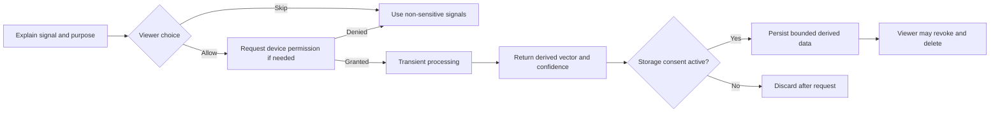

---

## 15. Non-functional requirements and service levels

| ID | Area | Target |
|---|---|---|
| NFR-01 | Cost and offline use | Default experience requires no paid service and no external AI key |
| NFR-02 | Catalog latency | p95 < 200 ms server time for seeded list/detail queries under demo load |
| NFR-03 | Recommendation latency | p50 < 100 ms and p95 < 300 ms for the 45-title deterministic engine, excluding optional provider inference |
| NFR-04 | Realtime propagation | p95 < 500 ms from accepted room command to connected clients on one node |
| NFR-05 | Concurrency | Demonstrate at least 10 rooms × 10 connected members on one development node without state corruption |
| NFR-06 | Reliability | No lost acknowledged room mutation; duplicate client action IDs do not apply twice |
| NFR-07 | Availability behavior | Optional provider outage degrades to heuristic/manual signals; backend outage degrades discovery to bundled catalog |
| NFR-08 | Type safety | Pydantic v2 schemas and generated/maintained TypeScript types agree at contract tests |
| NFR-09 | Accessibility | Core journeys meet WCAG 2.1 AA intent and work with keyboard/directional focus |
| NFR-10 | Observability | Structured logs, request IDs, safe error metrics, provider health, WS connection/event counters |
| NFR-11 | Configuration | 12-factor environment configuration with committed `.env.example` files and no secrets in source |
| NFR-12 | Portability | SQLite local mode; database URL can switch to Postgres without domain logic changes |
| NFR-13 | Browser support | Latest two stable versions of Chrome, Edge, Firefox, and Safari for the web demo |

---

## 16. Analytics and product measurement

Because the current system has no production baseline, the first release establishes instrumentation and validates usability. Improvement targets become meaningful only after a controlled baseline exists.

### 16.1 North-star outcome

**Successful decision rate:** percentage of eligible discovery sessions that result in a title being selected, queued, saved, or opened at an OTT destination within 10 minutes.

### 16.2 Supporting metrics

| Funnel | Metric | Initial validation target |
|---|---|---|
| Activation | Guest/sign-in to first useful recommendation | ≥ 90% in demo tests |
| Discovery | Median time from Home load to content decision | < 2 minutes in moderated usability tests |
| Explainability | Viewers who can identify why a title was recommended | ≥ 80% of test participants |
| Group decision | Rooms reaching a selected/queued title | ≥ 80% of completed demo rooms |
| Join quality | Valid invited users joining successfully | ≥ 95% in automated and demo runs |
| Realtime quality | Accepted events delivered within SLO | ≥ 99% under target demo load |
| Resilience | Core discovery remains usable during provider failure | 100% of provider-failure tests |
| Privacy | Optional signal disabled without blocking recommendations | 100% of consent combinations tested |

### 16.3 Event taxonomy

Collect only bounded product events such as `session_started`, `consent_changed`, `recommendations_shown`, `recommendation_selected`, `movie_saved`, `provider_link_opened`, `room_created`, `room_joined`, `group_recommendations_shown`, `poll_completed`, `queue_updated`, and `room_ended`. Each event carries pseudonymous session/user ID, request ID where relevant, timestamp, app version, and non-sensitive outcome metadata.

---

## 17. Failure modes and fallback behavior

| Failure | User experience | System behavior |
|---|---|---|
| Backend unavailable | Discovery remains available with “offline demo data” label; social/persistence actions are disabled with retry | Load bundled catalog; do not simulate successful writes |
| Optional mood provider unavailable | Show that the signal is unavailable and continue | Fall back to explicit emoji/text, then time/behavior/history |
| Camera/microphone denied | Continue without repeated permission prompts | Mark source unavailable; renormalize active weights |
| No history/new guest | Show contextual and popular recommendations | Skip the 20% history blend rather than blending zeros |
| WebSocket interrupted | Show reconnecting status; keep safe local draft text only | Reconnect with last sequence; request snapshot if replay is unavailable |
| Duplicate room command | No duplicate chat, vote, or queue item | Idempotently acknowledge the original action ID |
| Stale queue version | Refresh queue and explain the conflict if needed | Reject stale mutation or resolve through the authoritative room lock |
| Invalid/expired room | Preserve entered code and offer retry/back | Return a stable safe error without revealing protected room details |
| Database unavailable | Show temporary service error; never claim persistence | Fail closed for writes; health readiness becomes unhealthy |

---

## 18. Delivery strategy

Implementation follows the detailed [`EXECUTION_PLAN.md`](./EXECUTION_PLAN.md). The product must remain demoable after each stage.

```mermaid
flowchart LR
    P0["0. Repository structure"] --> P1["1. Backend and seeded catalog"]
    P1 --> P2["2. Deterministic recommendation engines"]
    P2 --> P3["3. Context services and provider fallback"]
    P3 --> P4["4. Realtime rooms and permissions"]
    P4 --> P5["5. Auth, users, social, and library"]
    P5 --> P6["6. Typed frontend API layer"]
    P6 --> P7["7. Screen-by-screen integration"]
    P7 --> P8["8. Realtime frontend integration"]
    P8 --> P9["9. Hardening, packaging, and docs"]
```

### Stage exit criteria

| Stage | Required exit evidence |
|---|---|
| Foundation | Production asset paths work; backend boots; database seeds exactly 45 titles; `/health` passes |
| Algorithms | Fixed-fixture unit tests validate formulas, deterministic ordering, missing-signal normalization, and prototype correction |
| Realtime | Two automated WebSocket clients validate presence, chat, reactions, queue, polls, moderation, disconnect, and idempotency |
| Identity/data | Guest and registered flows work; authorization tests cover cross-user and cross-room access |
| Frontend | All core screens use typed data hooks and intentional loading/empty/error/offline states |
| Packaging | `docker compose up` starts the product; fresh-clone instructions are verified by someone other than the author |

### Migration constraints

- Preserve original algorithm scripts under `research/` as provenance; do not import them at runtime.
- Canonical production logic lives once under backend domain services.
- Keep the existing UI markup and visual language unless a requirement needs a deliberate UX change.
- Use bundled data only as an explicit fallback, not as a silent competing source of truth.
- Prefer additive, independently reversible commits; avoid a single all-at-once integration change.

---

## 19. Verification strategy

### 19.1 Automated test layers

| Layer | Required coverage |
|---|---|
| Recommendation unit tests | Matrix shapes, formulas, normalization, decay, adaptive weights, stable ties, missing signals, explanations |
| Context unit tests | Time boundaries/timezones, behavior fixtures, emoji vectors, empty input, provider timeout/fallback |
| API tests | Schema validation, auth lifecycle, ownership, pagination/filtering, error contract, idempotent writes |
| Database tests | Constraints, seed integrity, relationship transitions, room event sequencing, migrations |
| WebSocket tests | Multi-client fan-out, ordering, reconnect, duplicate actions, role denial, kick/end behavior |
| Frontend tests | Query states, fallback banner, consent controls, remote/keyboard navigation, room connection states |
| Contract tests | Pydantic/OpenAPI response shapes agree with TypeScript consumers |
| End-to-end tests | Guest recommendation flow; registered persistence flow; protected two-client room flow |
| Build checks | Backend lint/type/test, frontend lint/type/build, container build, secret scan |

### 19.2 Critical demo scenarios

1. **Privacy-first personal flow:** skip camera and microphone, receive a time/behavior/manual-mood recommendation, inspect explanation, save a title.
2. **Provider failure flow:** select ONNX/local provider, simulate unavailability, verify fallback and no broken screen.
3. **Protected room flow:** create password-protected room, reject wrong password, accept correct password in second tab.
4. **Group decision flow:** join multiple seeded members, show group picks, complete poll, add winner to queue.
5. **Permission flow:** member attempts admin action and is denied; admin promotes member; new co-admin advances queue.
6. **Reconnect flow:** disconnect one client, mutate queue, reconnect, and converge to the current version without duplicates.
7. **Offline discovery flow:** stop backend, reload frontend, verify labeled bundled catalog and disabled remote-only actions.

---

## 20. Risks and mitigations

| Risk | Impact | Mitigation |
|---|---|---|
| Mood inference feels invasive or inaccurate | Trust loss and misleading personalization | Opt-in, manual alternative, confidence/unknown state, no raw retention, easy revocation |
| Group algorithm hides minority preferences | Poor group outcome | Show agreement/selectability; compute per-member metrics; allow poll/host override |
| Room state races | Divergent queues, votes, or roles | Per-room locks, monotonic versions, idempotency keys, authoritative snapshots |
| Single-node in-memory fan-out loses state on restart | Interrupted rooms | Persist room events/state; document demo limitation; add Redis in scale-out phase |
| OTT links or availability become stale | Broken or misleading destination | Label seeded data, validate configured links, treat live ingestion as future scope |
| Optional AI dependencies are heavy | Setup failures and slow inference | Lazy imports, isolated extras, timeouts, heuristic default |
| Frontend integration regresses polished UI | Demo quality drops | Screen-level migration, visual smoke tests, bundled fallback during transition |
| Existing algorithms use synthetic/random data | Unstable or non-credible results | Deterministic matrices, fixed fixtures, versioned metadata derivation |
| Authentication or room-code abuse | Unauthorized room access | Password hashing, short-lived membership tokens, uniform errors, throttling, audit events |
| Repository assets and research files are large | Slow clones/builds | Keep runtime assets in `public`, exclude research from images, document future LFS/archive path |

---

## 21. Assumptions, decisions, and open questions

### 21.1 Assumptions

- The 45-title seed remains sufficient for MVP validation.
- Single-node execution is acceptable for the hackathon/demo acceptance gate.
- Users can receive useful results without voice or facial signals.
- OTT playback remains owned by provider applications/sites unless supported integration contracts become available.
- Research notebooks and ONNX models demonstrate feasibility but are not required for the default runtime.

### 21.2 Decisions made in this PRD

| Decision | Rationale |
|---|---|
| FastAPI for the unified backend | Native async/WebSocket support and direct reuse of Python/NumPy domain knowledge |
| Relational storage over Neo4j | Current social/catalog relationships are straightforward and fit SQLite/Postgres |
| Heuristic/manual mood as default | Zero paid dependencies, faster startup, safer fallback |
| Server-authoritative rooms | Prevents browser-side role bypass and state divergence |
| Static demo fallback for discovery only | Keeps the demo useful without pretending remote writes/realtime succeeded |
| Cross-OTT discovery, not stream rebroadcast | Respects technical, licensing, authentication, and DRM boundaries |

### 21.3 Open questions requiring product/technical confirmation

1. What is the maximum room size for the first public demo: 10, 20, or another value?
2. Should a host be able to transfer ownership before leaving, or should leaving end the room?
3. How long should empty rooms, guest profiles, room chat, and derived mood signals be retained?
4. Are chat messages persisted for reconnect, and if so, for how long?
5. Which implicit behaviors are acceptable for adaptive weighting, and what event influence caps should apply?
6. Should provider deep links be omitted until an official link mapping is available, or included as clearly labeled demo links?
7. Is the first target strictly web, or must remote-control/navigation behavior be certified on actual Fire TV hardware?

These questions do not block the architecture; defaults must be recorded in configuration and tests before implementation of the affected feature is considered complete.

---

## 22. Definition of done

The product is done for MVP when:

- Product, API, WebSocket, data, consent, and error contracts in this PRD are implemented or explicitly deferred through an approved scope change.
- The repository has one canonical implementation for each algorithm and preserves research sources separately.
- Personal and group recommendation fixtures pass, including missing-signal normalization and correct per-member group metrics.
- Guest and registered end-to-end journeys pass.
- A protected, two-client room demonstrates presence, chat, reactions, queue, polls, roles, moderation, reconnect, and closure.
- Raw media is not persisted; consent combinations and revocation are tested.
- Frontend production build, backend test suite, contract tests, and container startup all pass.
- Static fallback is clearly labeled and never reports remote actions as successful.
- Setup, demo, architecture, limitations, and deployment documentation match the shipped system.

---

## Appendix A — Requirement traceability

| Product goal | Primary requirements | Verification |
|---|---|---|
| Contextual personal discovery | FR-CTX-01…05, FR-REC-01…06 | Recommendation/context fixtures + personal E2E flow |
| Fair group decision | FR-GRP-01…06 | Per-member scoring tests + group decision E2E flow |
| Reliable social room | FR-ROOM-01…10 | Multi-client WebSocket and permission tests |
| Persistent identity/social data | FR-AUTH-01…04, FR-SOC-01…03, FR-LIB-01…04 | API ownership tests + registered persistence flow |
| Demo resilience | FR-FE-01…05, NFR-01, NFR-07 | Provider failure and offline discovery scenarios |
| Privacy and trust | FR-CONSENT-01…02 + Section 14 | Consent matrix, deletion, logging, and data-model review |

## Appendix B — Glossary

| Term | Meaning |
|---|---|
| Active signal | A context source currently available and allowed by the viewer |
| Agreement | Dispersion of per-member scores for a candidate; lower standard deviation means stronger alignment |
| Compatibility matrix | Versioned numeric representation of how a title aligns with contextual attributes |
| Consensus score | Weighted match between user/group context and a title before or alongside priors |
| Deep link | Approved link that opens a provider app/site; it does not grant access or bypass authentication |
| Selectability | Percentage of eligible members whose score for a title exceeds the configured threshold |
| Static demo mode | Frontend fallback that serves bundled discovery data without pretending persistence/realtime is available |
| Room version | Monotonically increasing number for the authoritative state after each accepted mutation |
